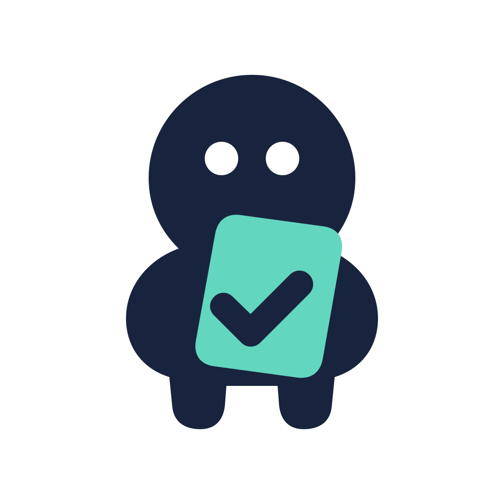

<p align="center">
  
</p>

# Buddy

> **Plan the work. Control the context. Ship with proof.**

Buddy is a structured development workflow for Codex, Claude Code, and Cursor. It turns an idea into durable research, an implementation-ready specification, focused coding phases, and verified delivery.

Most coding agents investigate, decide, implement, and validate inside one growing conversation. Buddy gives each kind of work its own contract—and carries the useful context forward without carrying all the noise.

> **Plan mode is a pause before coding. Buddy is the workflow around coding.**

## Why Buddy?

### Research becomes project knowledge

Buddy records facts, evidence, and remaining unknowns while it investigates. Findings live in `.ai/worklog/`, so the next stage starts from inspectable project knowledge instead of repeating the conversation.

### Specifications agents can execute

Buddy turns settled decisions into an exact implementation contract: requirements, affected files, dependencies, phase boundaries, exclusions, verification commands, and observable success criteria.

### Small tasks get focused context

Instead of handing one agent an entire change, Buddy gives each worker one bounded phase and only the evidence and instructions it needs. The scope is smaller, the expected result is explicit, and accidental expansion is easier to spot.

### The right model handles the right work

Buddy reserves frontier reasoning for architecture, ambiguity, and difficult decisions. Research and integration use balanced models. Once a detailed specification has removed the ambiguity, focused implementation phases can be handled by fast models.

**Frontier models make the decisions. Fast models execute the decisions.**

### Delivery ends with evidence

Each phase has its own success criteria. Buddy runs the relevant checks, records the outcome, and stops on unresolved failures. The result is not “the change should work”; it is a visible trail from question to verified delivery.

Buddy provides workflow guardrails, not a security boundary. Your coding tool's sandbox, permissions, and approval system remain authoritative.

## How it works

```text
idea
  → research the facts
  → settle the decisions
  → specify the implementation
  → execute focused phases
  → verify the result
```

The [`develop`](skills/develop/SKILL.md) skill coordinates the workflow. It selects only the stages the task needs, carries their artifacts forward, and assigns the configured fast, balanced, or frontier model for each kind of work. A narrow, decision-complete fix can go directly to implementation; larger or ambiguous work gets the research and specification it needs before code is touched.

| Stage | What Buddy produces | Default model role |
|---|---|---|
| **Research** | Persisted findings, evidence, and unknowns | Balanced; fast for bounded facts |
| **Innovate** | Meaningfully different solution directions | Frontier |
| **Specify** | A decision-complete implementation contract | Frontier |
| **Implement** | One bounded worker brief per ready phase | Fast after a detailed spec |
| **Verify** | Test results and observable delivery evidence | Appropriate to the check |

Model names are configured separately for each supported tool. Buddy resolves the requested role through a project profile, a user profile, or maintained packaged defaults. Unsupported or stale choices safely inherit the current orchestrator model instead of being silently replaced.

## What Buddy leaves behind

Research is written as durable, reviewable evidence:

```markdown
## FINDINGS
- The customer endpoint already uses the shared authorization middleware.
- Existing API responses follow `CustomerResponse`.

## UNKNOWNS
- Should archived customers be returned?
```

Once decisions are settled, the specification turns implementation into bounded phases:

```yaml
phase: Add the customer endpoint
files_touched:
  - src/customers/api.ts
depends_on:
  - Define the customer schema
success_criteria:
  - The endpoint returns the documented response shape
  - The focused API tests pass
out_of_scope:
  - Database migrations
```

The worker gets the goal, inputs, boundaries, and proof required for that phase—not the entire project history.

## Try it

For a complete change, give Buddy the outcome and let `develop` coordinate the workflow:

> **Develop customer search with filters and pagination**

That is enough. You can also invoke one focused stage when that is all you need:

**Research without changing code**

> **Research how customer search currently works, including its API, data flow, tests, and remaining unknowns**

**Create an implementation-ready specification**

> **Create a spec for customer search with filters and pagination**

**Run an approved specification**

> **/implement `.ai/worklog/20260804_customer-search/spec_customer-search.md`**

The focused skills return after their own stage. `develop` is the end-to-end entry point that continues through implementation and verification.

## Skills

| Skill | Use it to |
|---|---|
| [`develop`](skills/develop/SKILL.md) | Coordinate a non-trivial change from initial question to verified delivery. |
| [`research`](skills/research/SKILL.md) | Investigate facts and preserve the findings without changing product code. |
| [`innovate`](skills/innovate/SKILL.md) | Compare meaningfully different solution directions. |
| [`spec`](skills/spec/SKILL.md) | Turn settled decisions into an implementation-ready contract. |
| [`implement`](skills/implement/SKILL.md) | Build a narrow request or execute one approved specification phase. |
| [`test-runner`](skills/test-runner/SKILL.md) | Discover and run the relevant validation. |
| [`configure-models`](skills/configure-models/SKILL.md) | Choose the fast, balanced, and frontier models for the current tool. |
| [`archive-worklogs`](skills/archive-worklogs/SKILL.md) | Archive completed development worklogs. |

## Install

<details open>
<summary><strong>Codex CLI</strong> — GitHub marketplace</summary>

Add Buddy's GitHub repository as a marketplace, then install the plugin:

```bash
codex plugin marketplace add leszekgruchala/buddy --ref main
codex plugin add buddy@buddy
```

Restart Codex and start a new task so it loads the installed skills. Add the marketplace only once; refresh its Git snapshot later with:

```bash
codex plugin marketplace upgrade buddy
```

</details>

<details>
<summary><strong>ChatGPT desktop app</strong> — Plugin Directory</summary>

Open the Plugin Directory, find **Buddy**, then select **Install** or **Connect**.

This is separate from the Codex CLI installation. Installing Buddy from GitHub in the CLI does not install it in the desktop app. If Buddy is not listed in your Plugin Directory, use the Codex CLI path above.

</details>

<details>
<summary><strong>Claude Code</strong> — GitHub marketplace</summary>

Add the marketplace and install Buddy from an interactive Claude Code session or your terminal:

```bash
claude plugin marketplace add leszekgruchala/buddy@main
claude plugin install buddy@buddy
```

Restart Claude Code, or run `/reload-plugins`, before starting work with Buddy.

</details>

<details>
<summary><strong>Cursor</strong> — Marketplace or local folder</summary>

**Marketplace:** Once Buddy is published, open the [Cursor Marketplace](https://cursor.com/marketplace), find **Buddy**, and install it from **Customize**.

**Local folder:** Until then, place a copy of the plugin under `~/.cursor/plugins/local/`.

macOS or Linux:

```bash
git clone https://github.com/leszekgruchala/buddy.git
mkdir -p ~/.cursor/plugins/local
rsync -a --delete --exclude .git buddy/ ~/.cursor/plugins/local/buddy/
```

After pulling updates, rerun the `rsync` command.

Windows PowerShell:

```powershell
git clone https://github.com/leszekgruchala/buddy.git
robocopy buddy "$env:USERPROFILE\.cursor\plugins\local\buddy" /MIR /XD .git .ai
```

After copying or updating the local folder, reload the Cursor window with **Developer: Reload Window**.

Buddy should appear under **Customize** with its skills and agents. The destructive-command hook registers through the plugin manifest, so also confirm **Customize → Plugins** lists Buddy and it is enabled. Skills can appear from the local copy before the hook does; if the hook is missing, toggle Buddy off and on in **Customize → Plugins**, or reinstall from a registered marketplace entry.

For CLI-only testing against your checkout, start a new agent with:

```bash
cursor-agent --plugin-dir /path/to/buddy
```

</details>

See [harness compatibility](docs/harness-compatibility.md) for platform behavior and local-development refresh details.

### Destructive-command guard

Buddy bundles a shell guard that blocks destructive infrastructure, container, cloud, database, SQL, and unsafe file-removal commands before they execute. Direct removal is allowed only for explicit literal targets inside the active Git worktree.

The initial verified runtime is macOS 10.15 or newer and requires:

- `/bin/zsh`;
- `jq` on `PATH` or in a standard Homebrew/system location;
- `git` on `PATH` or in a standard Homebrew/system location.

If the hook cannot parse its input or find a required dependency, it blocks shell execution and tells the agent not to retry or work around the policy.

After installation:

- **Codex:** restart Codex, open `/hooks`, and review and trust Buddy's `PreToolUse` hook.
- **Claude Code:** restart Claude Code or run `/reload-plugins`; the plugin loads the shared `PreToolUse` hook automatically.
- **Cursor:** reload the window, confirm Buddy is enabled under **Customize → Plugins**, then check **Customize → Hooks** and the **Hooks output channel** for Buddy's `beforeShellExecution` entry. User-level hooks in `~/.cursor/hooks.json` are separate and do not show plugin hooks.

For a safe denial check, ask the agent to run `terraform apply -help`. Buddy should block it before Terraform starts. The hook is not yet guaranteed in Cursor Cloud Agents: Cursor currently documents repository, team, and enterprise hooks as its cloud-visible hook sources, but not hooks bundled inside an installed plugin.

## Setup

After installing Buddy, ask:

> **Configure the models Buddy should use here.**

Buddy will help select the fast, balanced, and frontier roles available in the current tool. Configuration can be saved to:

- `.buddy/model-profile.yaml` for project-specific choices that can travel with a committed checkout;
- `~/.buddy/model-profile.yaml` for reusable local preferences across projects.

Project configuration takes precedence for that tool. A local user profile does not travel automatically to cloud workers. See [`configure-models`](skills/configure-models/SKILL.md) and the [model profile contract](skills/model-policy/reference.md) for the exact behavior.
